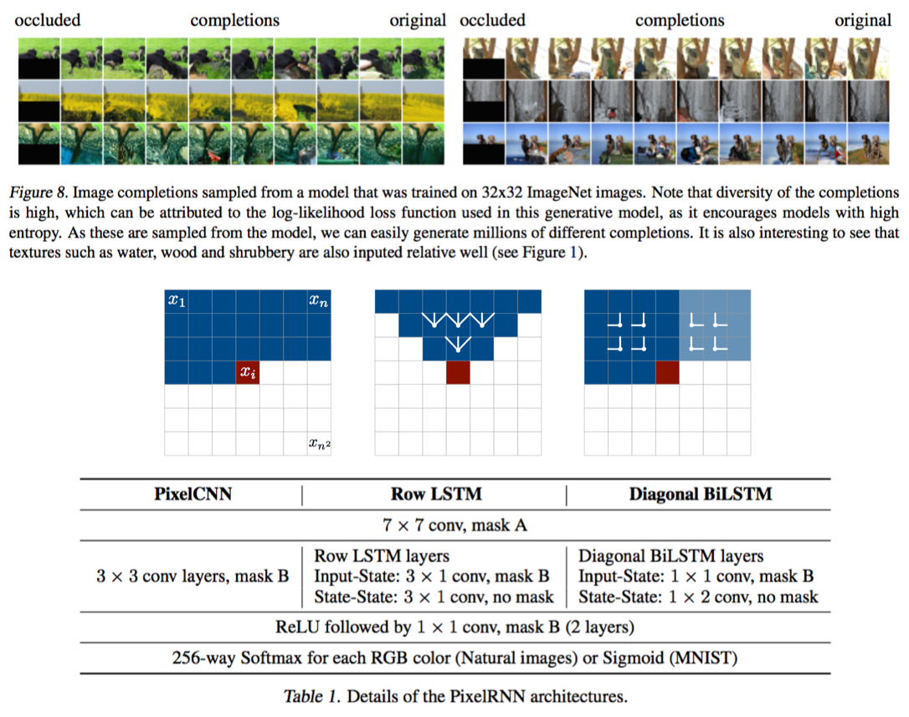
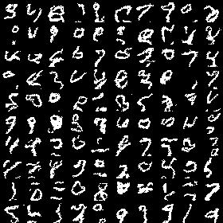
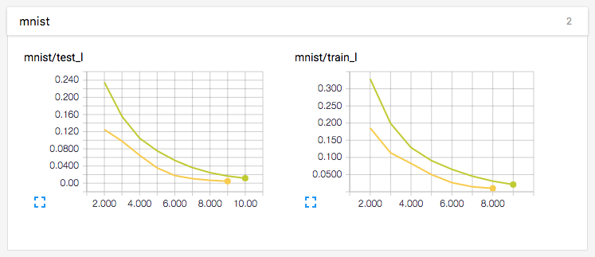
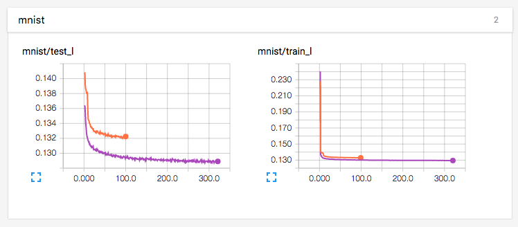
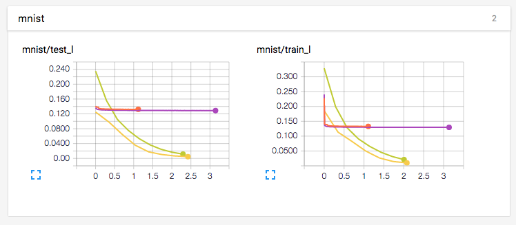

# PixelCNN & PixelRNN in TensorFlow

TensorFlow implementation of [Pixel Recurrent Neural Networks](https://arxiv.org/abs/1601.06759). This implementation contains:

1. PixelCNN
  - Masked Convolution (A, B)
2. PixelRNN
  - Row LSTM (in progress)
  - Diagonal BiLSTM (skew, unskew)
  - Residual Connections
  - Multi-Scale PixelRNN (in progress)
3. Datasets
  - MNIST
  - cifar10 (in progress)
  - ImageNet (in progress)

## Requirements

- Python 2.7
- [Scipy](https://www.scipy.org/)
- [TensorFlow](https://www.tensorflow.org/) 0.9+

## Usage

First, install prerequisites with:

    $ pip install tqdm gym[all]

To train a `pixel_rnn` model with `mnist` data (slow iteration, fast convergence):

    $ python main.py --data=mnist --model=pixel_rnn

To train a `pixel_cnn` model with `mnist` data (fast iteration, slow convergence):

    $ python main.py --data=mnist --model=pixel_cnn --hidden_dims=64 --recurrent_length=2 --out_hidden_dims=64

To generate images with trained model: 

    $ python main.py --data=mnist --model=pixel_rnn --is_train=False

## Samples

Samples generated with `pixel_cnn` after 50 epochs.

## Training details

Below results uses two different parameters

[1] `--hidden_dims=16 --recurrent_length=7 --out_hidden_dims=32`  
[2] `--hidden_dims=64 --recurrent_length=2 --out_hidden_dims=64`

Training results of `pixel_rnn` with \[1\] (yellow) and \[2\] (green) with `epoch` as x-axis:

Training results of `pixel_cnn` with \[1\] (orange) and \[2\] (purple) with `epoch` as x-axis:

Training results of `pixel_rnn` (yellow, green) and `pixel_cnn` (orange, purple) with `hour` as x-axis:

## References

- [Pixel Recurrent Neural Networks](https://arxiv.org/abs/1601.06759)
- [Conditional Image Generation with PixelCNN Decoders](https://arxiv.org/abs/1606.05328)
- [Review by Kyle Kastner](https://github.com/tensorflow/magenta/blob/master/magenta/reviews/pixelrnn.md)
- [igul222/pixel_rnn](https://github.com/igul222/pixel_rnn)
- [kundan2510/pixelCNN](https://github.com/kundan2510/pixelCNN)

## Author

Taehoon Kim / [@carpedm20](http://carpedm20.github.io/)
